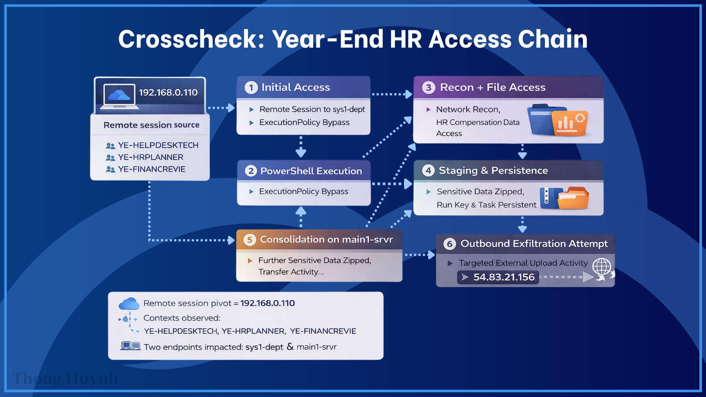

# Threat Hunt Report – ❌ Crosscheck

* **Hunt Name:** Crosscheck
* **Author:** Thong Huynh
* **Date:** 2026-02-02
* **Environment:** Microsoft Sentinel + Microsoft Defender for Endpoint
* **Hunt Type:** Hypothesis-Driven, Multi-Endpoint Threat Hunt
* **Severity:** High (Sensitive HR Data Access with Staging and Transfer Attempts)

## Executive Summary

During early December 2025, irregular access patterns were observed amid routine year-end compensation and performance review activities. What initially appeared as legitimate departmental and administrative behavior revealed a coordinated, multi-stage sequence involving unauthorized script execution, sensitive HR file access, data staging, persistence mechanisms, outbound connectivity testing, and attempted log clearing.

The activity originated on a departmental workstation (`sys1-dept`) and later expanded to a second endpoint (`main1-srvr`), leveraging multiple remote session contexts across departments. Sensitive bonus matrices, performance reviews, and employee scorecards were accessed, staged into archives, and followed by outbound transfer attempts to external endpoints.

The sequencing, escalation, and repetition across systems demonstrate intent beyond benign administrative activity.

**Outcome:**

* Unauthorized access to draft and approved HR compensation artifacts
* Multi-layer persistence mechanisms identified
* Data staging and outbound transfer attempts observed
* Scope expanded to a second endpoint

## Hunt Objective & Hypothesis

**Objective:**
Determine whether year-end compensation and performance review access across multiple endpoints and departments represents legitimate administrative workflows or coordinated misuse of access involving staging and potential exfiltration of sensitive HR data.

**Hypothesis:**
If HR-related access was misused during year-end operations, endpoint telemetry will reveal interactive, hands-on activity that deviates from standard workflows. This includes support-themed PowerShell execution from user-writable paths, reconnaissance commands, sensitive file access across departments, data staging into archives, persistence mechanisms, outbound connectivity testing, and attempts to reduce forensic visibility.

## Data Sources

| Data Source          | Platform                        |
| -------------------- | ------------------------------- |
| DeviceProcessEvents  | Microsoft Defender for Endpoint |
| DeviceFileEvents     | Microsoft Defender for Endpoint |
| DeviceNetworkEvents  | Microsoft Defender for Endpoint |
| DeviceRegistryEvents | Microsoft Defender for Endpoint |
| DeviceEvents         | Microsoft Defender for Endpoint |

## Scope

* **Primary Time Range:** `2025-12-03` to `2025-12-04`
* **Assets in Scope:** HR and departmental systems involved in year-end review workflows
* **Primary Endpoint:** `sys1-dept`
* **Secondary Endpoint:** `main1-srvr`
* **Primary User Context:** `5y51-d3p7`
* **Remote Session IP:** `192.168.0.110`
* **Remote Session Contexts Observed:**

  * YE-HELPDESKTECH
  * YE-HRPLANNER
  * YE-FINANCEREVIE

## Methodology

This hunt followed a **timeline-driven, behavior-first approach**:

1. Identified the earliest endpoint associated with suspicious user context
2. Correlated remote session metadata to establish source attribution
3. Anchored the timeline on initial script execution
4. Tracked reconnaissance, discovery, and file access behavior
5. Identified data staging and archive creation
6. Evaluated persistence mechanisms across registry and scheduled tasks
7. Tracked outbound connectivity attempts
8. Expanded scope to additional endpoints based on shared indicators
9. Assessed intent through repetition, escalation, and cleanup activity

Early queries were intentionally broad to establish context before narrowing into specific behaviors.

## Investigation Timeline

| Timestamp (UTC)  | Event                                                                                  |
| ---------------- | -------------------------------------------------------------------------------------- |
| 2025-12-03 01:24 | Remote session initiated to `sys1-dept` from `192.168.0.110`.                          |
| 2025-12-03 06:07 | Support-themed PowerShell script executed from Downloads with execution policy bypass. |
| 2025-12-03 06:12 | Reconnaissance sequence begins (`whoami`, `quser`, `qwinsta`, `tasklist`, `nslookup`). |
| 2025-12-03 06:27 | Draft bonus matrix accessed via Notepad.                                               |
| 2025-12-03 06:27 | First outbound connectivity test to `example.com`.                                     |
| 2025-12-03 06:27 | Data staging initiated (`export_stage.zip`).                                           |
| 2025-12-03 06:28 | Scheduled task `BonusReviewAssist` created.                                            |
| 2025-12-03 07:25 | Employee performance reviews accessed.                                                 |
| 2025-12-03 07:25 | Approved bonus matrix accessed (`BonusMatrix_Q4_Approved.xlsx`).                       |
| 2025-12-03 07:26 | Candidate archive created (`Q4Candidate_Pack.zip`).                                    |
| 2025-12-03 07:26 | Outbound POST-style connectivity test to `httpbin.org`.                                |
| 2025-12-03 08:18 | PowerShell operational logs cleared using `wevtutil`.                                  |
| 2025-12-04 03:11 | Approved bonus matrix accessed again on `main1-srvr`.                                  |
| 2025-12-04 03:15 | Consolidated archive created on second endpoint.                                       |
| 2025-12-04 03:15 | Final outbound connection to `httpbin.org` from `main1-srvr`.                          |

## Key Findings

### Support-Themed Script Execution

* PowerShell executed a payroll-themed script from a user Downloads directory using execution policy bypass.

### Progressive Reconnaissance

* Immediate execution of identity, session, process, and network discovery commands.

### Sensitive HR Data Access

* Draft, approved, and employee-related HR artifacts accessed across directories and endpoints.

### Data Staging and Archival

* Multiple ZIP archives created to consolidate HR and candidate materials.

### Persistence Mechanisms

* Registry Run key (`PayrollUpdater`) and scheduled task (`BonusReviewAssist`) established.

### Outbound Connectivity Testing

* Repeated connections to benign external endpoints (`example.com`, `httpbin.org`) consistent with egress validation.

### Log Clearing Attempt

* PowerShell operational logs cleared using `wevtutil`, indicating awareness of forensic visibility.

### Lateral Expansion

* Activity repeated on a second endpoint (`main1-srvr`) with similar access and staging patterns.

## MITRE ATT&CK Mapping

| Tactic            | Technique                                      | ID        |
| ----------------- | ---------------------------------------------- | --------- |
| Execution         | Command and Scripting Interpreter (PowerShell) | T1059.001 |
| Discovery         | System Information Discovery                   | T1082     |
| Discovery         | Process Discovery                              | T1057     |
| Discovery         | Permission Groups Discovery                    | T1069     |
| Collection        | Data from Information Repositories             | T1213     |
| Collection        | Archive Collected Data                         | T1560     |
| Persistence       | Registry Run Keys / Startup Folder             | T1547.001 |
| Persistence       | Scheduled Task / Job                           | T1053     |
| Exfiltration Prep | Data Staging                                   | T1074     |
| Defense Evasion   | Clear Windows Event Logs                       | T1070.001 |

## Indicators of Compromise (IOCs)

| Type           | Value                          |
| -------------- | ------------------------------ |
| Hostname       | sys1-dept                      |
| Hostname       | main1-srvr                     |
| Account        | 5y51-d3p7                      |
| Remote IP      | 192.168.0.110                  |
| File           | PayrollSupportTool.ps1         |
| File           | BonusMatrix_Draft_v3.xlsx      |
| File           | BonusMatrix_Q4_Approved.xlsx   |
| Archive        | Q4Candidate_Pack.zip           |
| Archive        | YearEnd_ReviewPackage_2025.zip |
| Scheduled Task | BonusReviewAssist              |
| Registry Value | PayrollUpdater                 |
| External IP    | 54.83.21.156                   |

## Response Actions

* Disable and remove scheduled task `BonusReviewAssist`
* Remove registry-based Run key persistence
* Preserve and review all staged ZIP archives
* Review access logs for HR-related directories
* Reset credentials for involved accounts
* Validate outbound filtering and egress controls

## Detection Gaps & Improvements

The activity blended into expected year-end workflows, reducing alert fidelity when events were viewed in isolation.

**Improvements:**

* Alert on PowerShell execution from user-writable paths
* Correlate short recon command bursts with sensitive file access
* Flag archive creation following HR file reads
* Alert on log-clearing utilities executed in user context

## Lessons Learned

* Year-end business processes create ideal cover for sensitive data misuse
* Sequencing and repetition provide stronger signal than individual events
* Support-themed tooling and benign endpoints are effective camouflage
* Cross-endpoint repetition strongly indicates intent

## Recommendations

* Restrict ad-hoc PowerShell execution on non-IT systems
* Enforce approved tooling for HR and support workflows
* Increase correlation around sensitive HR directories
* Monitor registry and scheduled task creation tied to user accounts
* Treat benign external connectivity tests as potential exfiltration precursors

<details>
<summary><h2><strong>Appendix: Supporting Queries and Evidence (click to expand)</strong></h2></summary>

The following sections document the investigative queries used during the **❌ Crosscheck** hunt, along with the corresponding evidence observed in endpoint telemetry to support each finding.

---

### Finding 1: Initial Endpoint Association

```kql
let start = datetime('2025-12-01');
let end   = datetime('2025-12-30');
DeviceProcessEvents
| where TimeGenerated between (start .. end)
| where tolower(AccountName) !in ("system", "local service", "network service")
| where AccountName == "5y51-d3p7"
| where ProcessCommandLine contains "powershell"
| project TimeGenerated, DeviceName, AccountName, FileName, ProcessCommandLine
| order by TimeGenerated asc
```

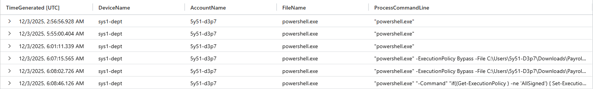

**Evidence observed:**
User account `5y51-d3p7` first appears executing PowerShell on endpoint `sys1-dept`.

**Why it matters:**
This establishes the initial host in scope and anchors the investigation timeline.

---

### Finding 2: Remote Session Source Attribution

```kql
let start = datetime('2025-12-03');
let end   = datetime('2025-12-06');
DeviceProcessEvents
| where TimeGenerated between (start .. end)
| where tolower(AccountName) !in ("system", "local service", "network service")
| where DeviceName == "sys1-dept"
| project TimeGenerated, DeviceName, AccountName, ProcessRemoteSessionIP,
          ProcessCommandLine, InitiatingProcessFileName, InitiatingProcessCommandLine
| order by TimeGenerated asc
```

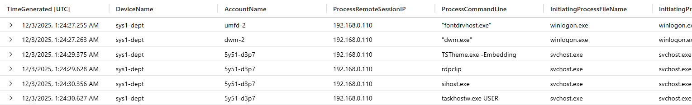

**Evidence observed:**
Remote session activity consistently originated from `192.168.0.110`.

**Why it matters:**
Identifies the remote access source used throughout the activity chain.

---

### Finding 3: Support-Themed Script Execution

```kql
let start = datetime('2025-12-03');
let end   = datetime('2025-12-06');
DeviceProcessEvents
| where TimeGenerated between (start .. end)
| where tolower(AccountName) !in ("system", "local service", "network service")
| where DeviceName == "sys1-dept"
| where ProcessCommandLine contains "support"
| where InitiatingProcessCommandLine has "powershell"
      or ProcessCommandLine has "powershell"
| project TimeGenerated, DeviceName, ProcessCommandLine,
          InitiatingProcessFileName, InitiatingProcessCommandLine, ProcessRemoteSessionIP
| order by TimeGenerated asc
```

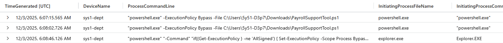

**Evidence observed:**
`PayrollSupportTool.ps1` executed from a user Downloads directory using execution policy bypass.

**Why it matters:**
Support-themed scripts executed from user-writable paths indicate interactive, non-standard tooling.

---

### Finding 4: System Reconnaissance Initiation

```kql
let start = datetime('2025-12-03');
let end   = datetime('2025-12-06');
DeviceProcessEvents
| where TimeGenerated between (start .. end)
| where tolower(AccountName) !in ("system", "local service", "network service")
| where DeviceName == "sys1-dept"
| where InitiatingProcessCommandLine has "powershell"
      or ProcessCommandLine has "powershell"
| project TimeGenerated, DeviceName, AccountName, FileName,
          ProcessCommandLine, InitiatingProcessFileName,
          InitiatingProcessCommandLine, ProcessRemoteSessionIP
| order by TimeGenerated asc
```

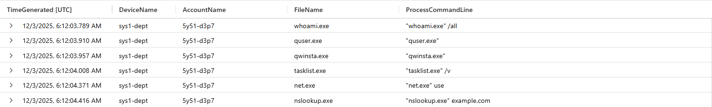

**Evidence observed:**
Recon commands executed: `whoami`, `quser`, `qwinsta`, `tasklist`, `net use`, `nslookup`.

**Why it matters:**
Rapid recon sequencing reflects hands-on-keyboard assessment of the environment.

---

### Finding 5: Sensitive Bonus Draft Access

```kql
let start = datetime('2025-12-03');
let end   = datetime('2025-12-06');
DeviceProcessEvents
| where TimeGenerated between (start .. end)
| where tolower(AccountName) !in ("system", "local service", "network service")
| where DeviceName == "sys1-dept"
| where ProcessCommandLine contains "bonus"
| project TimeGenerated, DeviceName, AccountName, FileName, ProcessCommandLine
| order by TimeGenerated asc
```

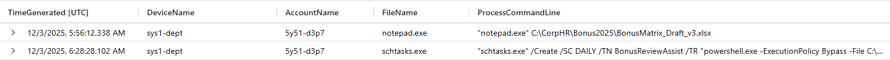

**Evidence observed:**
`BonusMatrix_Draft_v3.xlsx` accessed using Notepad.

**Why it matters:**
Use of generic tools to open sensitive files bypasses normal application auditing.

---

### Finding 6: Data Staging Activity

```kql
let start = datetime('2025-12-03');
let end   = datetime('2025-12-06');
DeviceFileEvents
| where TimeGenerated between (start .. end)
| where DeviceName == "sys1-dept"
| where tolower(InitiatingProcessAccountName)
      !in ("system", "local service", "network service")
| where FileName has "zip"
| order by TimeGenerated desc
| project TimeGenerated, DeviceName, ActionType, FileName,
          FolderPath, InitiatingProcessUniqueId, InitiatingProcessAccountName
```

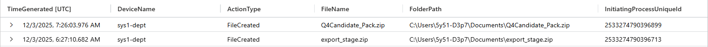

**Evidence observed:**
ZIP archives created with unique initiating process ID `2533274790396713`.

**Why it matters:**
Archiving indicates preparation for movement beyond simple viewing.

---

### Finding 7: Outbound Connectivity Test

```kql
let start = datetime('2025-12-02T16:22:27.6588913Z');
let end   = datetime('2025-12-05');
DeviceNetworkEvents
| where TimeGenerated between (start .. end)
| where DeviceName == "sys1-dept"
| where InitiatingProcessAccountName == "5y51-d3p7"
| where InitiatingProcessCommandLine has "powershell"
| project TimeGenerated, DeviceName, InitiatingProcessAccountName,
          RemoteIP, RemotePort, RemoteUrl, Protocol, LocalIP
| order by TimeGenerated asc
```

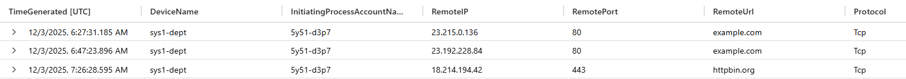

**Evidence observed:**
Outbound connections to `example.com` and `httpbin.org`.

**Why it matters:**
Connectivity tests often precede data transfer attempts.

---

### Finding 8: Registry-Based Persistence

```kql
let start = datetime('2025-12-03');
let end   = datetime('2025-12-06');
DeviceRegistryEvents
| where TimeGenerated between (start .. end)
| where DeviceName == "sys1-dept"
| where tolower(InitiatingProcessAccountName)
      !in ("system", "local service", "network service")
| project TimeGenerated, DeviceName, RegistryKey,
          RegistryValueName, RegistryValueData
| order by TimeGenerated
```

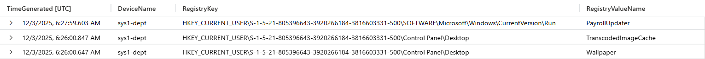

**Evidence observed:**
Run key created under HKCU with value `PayrollUpdater`.

**Why it matters:**
Registry Run keys provide automatic execution at logon.

---

### Finding 9: Scheduled Task Persistence

```kql
let start = datetime('2025-12-03');
let end   = datetime('2025-12-06');
DeviceProcessEvents
| where TimeGenerated between (start .. end)
| where tolower(AccountName)
      !in ("system", "local service", "network service")
| where DeviceName == "sys1-dept"
| where ProcessCommandLine contains "sch"
| where InitiatingProcessCommandLine has "powershell"
      or ProcessCommandLine has "powershell"
| project TimeGenerated, DeviceName, ProcessCommandLine,
          InitiatingProcessFileName, InitiatingProcessCommandLine,
          ProcessRemoteSessionIP
| order by TimeGenerated asc
```

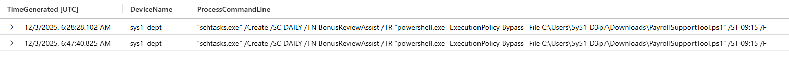

**Evidence observed:**
Scheduled task `BonusReviewAssist` created for recurring execution.

**Why it matters:**
Scheduled tasks provide durable persistence beyond user sessions.

---

### Finding 10: Remote Session Context Enumeration

```kql
let start = datetime('2025-12-03');
let end   = datetime('2025-12-06');
DeviceFileEvents
| where TimeGenerated between (start .. end)
| where DeviceName == "sys1-dept"
| where tolower(InitiatingProcessAccountName)
      !in ("system", "local service", "network service")
| summarize this = count() by InitiatingProcessRemoteSessionDeviceName
```

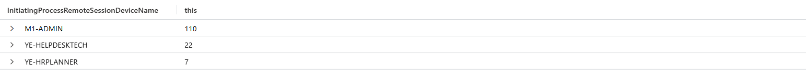

**Evidence observed:**
Multiple remote session contexts detected (YE-HELPDESKTECH, YE-HRPLANNER).

**Why it matters:**
Confirms cross-departmental access patterns.

---

### Finding 11: Secondary Remote Session (HR Planner)

```kql
let start = datetime('2025-12-03');
let end   = datetime(2025-12-05);
DeviceFileEvents
| where TimeGenerated between (start .. end)
| where DeviceName == "sys1-dept"
| where tolower(InitiatingProcessAccountName)
      !in ("system", "local service", "network service")
| summarize this = count() by InitiatingProcessRemoteSessionDeviceName
```

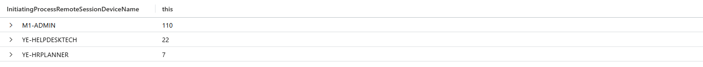

**Evidence observed:**
Remote session `YE-HRPLANNER` accessed HR-related artifacts.

**Why it matters:**
Confirms escalation beyond initial helpdesk context.

---

### Finding 12: Performance Review Access

```kql
let start = datetime('2025-12-03');
let end   = datetime('2025-12-05');
DeviceProcessEvents
| where TimeGenerated between (start .. end)
| where tolower(AccountName)
      !in ("system", "local service", "network service")
| where DeviceName == "sys1-dept"
| where ProcessCommandLine contains "note"
| project TimeGenerated, DeviceName, AccountName,
          FileName, ProcessCommandLine
| order by TimeGenerated asc
```

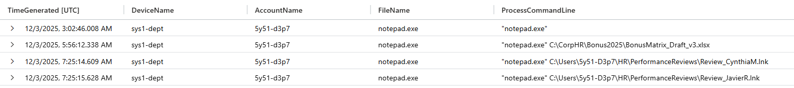

**Evidence observed:**
Employee performance reviews accessed via Notepad.

**Why it matters:**
Unintentional or improper access to personnel records.

---

### Finding 13: Approved Bonus Artifact Access

```kql
let start = datetime('2025-12-03');
let end   = datetime('2025-12-05');
search "BonusMatrix_Q4_Approved.xlsx"
| where TimeGenerated between (start .. end)
| project TimeGenerated, ActionType, FileName,
          FolderPath, ProcessCommandLine
| order by TimeGenerated asc
```

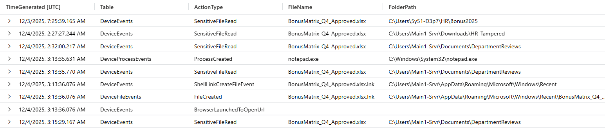

**Evidence observed:**
Approved bonus matrix accessed and read.

**Why it matters:**
Approved artifacts carry higher business and regulatory risk.

---

### Finding 14: Candidate Archive Creation

```kql
let start = datetime('2025-12-03');
let end   = datetime('2025-12-05');
DeviceFileEvents
| where TimeGenerated between (start .. end)
| where InitiatingProcessRemoteSessionIP == "192.168.0.110"
| where FolderPath contains ".zip"
| project TimeGenerated, ActionType, FileName,
          FolderPath, InitiatingProcessRemoteSessionDeviceName
| order by TimeGenerated asc
```

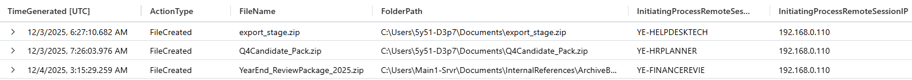

**Evidence observed:**
`Q4Candidate_Pack.zip` created in user Documents directory.

**Why it matters:**
Packaging candidate data indicates consolidation for movement.

---

### Finding 15: Outbound Transfer Attempt

```kql
let start = datetime('2025-12-03');
let end   = datetime('2025-12-05');
DeviceNetworkEvents
| where TimeGenerated between (start .. end)
| where isnotempty(RemoteUrl)
| where InitiatingProcessRemoteSessionIP == "192.168.0.110"
| where InitiatingProcessCommandLine contains "powershell"
| project TimeGenerated, DeviceName, RemoteIP,
          RemotePort, RemoteUrl,
          InitiatingProcessRemoteSessionDeviceName
| order by TimeGenerated asc
```

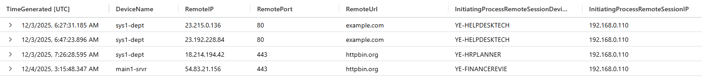

**Evidence observed:**
Outbound POST-style connectivity to `httpbin.org`.

**Why it matters:**
Common exfiltration test endpoint.

---

### Finding 16: Log Clearing Attempt

```kql
let start = datetime('2025-12-03');
let end   = datetime('2025-12-05');
DeviceProcessEvents
| where TimeGenerated between (start .. end)
| where ProcessRemoteSessionIP == "192.168.0.110"
| where ProcessCommandLine contains "cl"
| project TimeGenerated, DeviceName, AccountName,
          FileName, ProcessCommandLine
| order by TimeGenerated asc
```

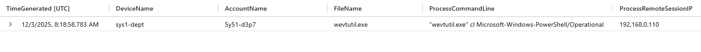

**Evidence observed:**
`wevtutil.exe cl Microsoft-Windows-PowerShell/Operational`.

**Why it matters:**
Indicates attempt to reduce forensic visibility.

---

### Finding 17: Second Endpoint Identification

```kql
let start = datetime('2025-12-03');
let end   = datetime('2025-12-05');
DeviceProcessEvents
| where TimeGenerated between (start .. end)
| where ProcessRemoteSessionIP == "192.168.0.110"
| where InitiatingProcessCommandLine contains "powershell"
| summarize machine = count() by DeviceName
```

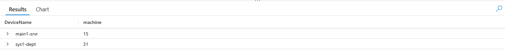

**Evidence observed:**
Second endpoint `main1-srvr` identified.

**Why it matters:**
Confirms expanded scope beyond the initial system.

---

### Finding 18: Approved Bonus Access on Second Endpoint

```kql
let start = datetime('2025-12-03');
let end   = datetime('2025-12-05');
DeviceProcessEvents
| where TimeGenerated between (start .. end)
| where DeviceName == "main1-srvr"
| where ProcessCommandLine contains "approve"
| project TimeGenerated, DeviceName, AccountName,
          FileName, ProcessCommandLine
| order by TimeGenerated asc
```

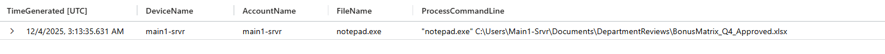

**Evidence observed:**
Approved bonus matrix accessed again on `main1-srvr`.

**Why it matters:**
Repetition across systems strengthens intent.

---

### Finding 19: Employee Scorecard Access (Second Endpoint)

```kql
let start = datetime('2025-12-03');
let end   = datetime('2025-12-05');
DeviceProcessEvents
| where TimeGenerated between (start .. end)
| where DeviceName == "main1-srvr"
| where ProcessCommandLine contains "card"
| project TimeGenerated, DeviceName,
          ProcessRemoteSessionDeviceName, ProcessCommandLine
| order by TimeGenerated asc
```

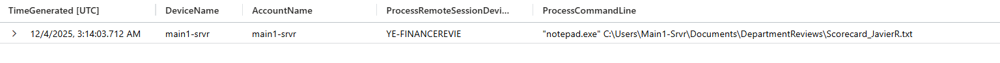

**Evidence observed:**
Employee scorecard accessed by `YE-FINANCEREVIE`.

**Why it matters:**
Confirms sensitive personnel data access by finance context.

---

### Finding 20: Consolidated Staging Directory

```kql
let start = datetime('2025-12-03');
let end   = datetime('2025-12-05');
search "zip"
| where TimeGenerated between (start .. end)
| where InitiatingProcessRemoteSessionIP == "192.168.0.110"
| project TimeGenerated, DeviceName,
          FileName, FolderPath, ProcessCommandLine
| order by TimeGenerated asc
```

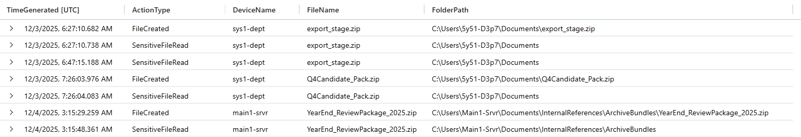

**Evidence observed:**
`YearEnd_ReviewPackage_2025.zip` created under InternalReferences.

**Why it matters:**
Centralized staging prior to final transfer.

---

### Finding 21: Staging Activity Timing

```kql
let start = datetime('2025-12-03');
let end   = datetime('2025-12-05');
DeviceFileEvents
| where TimeGenerated between (start .. end)
| where InitiatingProcessRemoteSessionIP == "192.168.0.110"
| where FolderPath contains @"InternalReferences"
| project TimeGenerated, ActionType, FolderPath,
          InitiatingProcessRemoteSessionDeviceName
| order by TimeGenerated asc
```

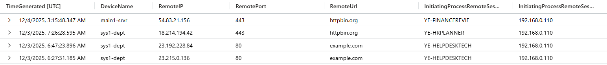

**Evidence observed:**
Final staging activity at `2025-12-04T03:15:29.2597235Z`.

**Why it matters:**
Confirms timing relative to access and outbound activity.

---

### Finding 22: Final Outbound Connection

```kql
let start = datetime('2025-12-03');
let end   = datetime('2025-12-05');
DeviceNetworkEvents
| where TimeGenerated between (start .. end)
| where InitiatingProcessRemoteSessionIP == "192.168.0.110"
| where isnotempty(RemoteUrl)
| where InitiatingProcessCommandLine contains "powershell"
| project TimeGenerated, DeviceName, RemoteIP,
          RemotePort, RemoteUrl,
          InitiatingProcessRemoteSessionDeviceName
| order by TimeGenerated desc
```

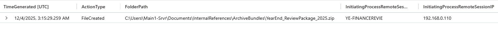

**Evidence observed:**
Outbound connection to `54.83.21.156` from `main1-srvr`.

**Why it matters:**
Final-stage external communication consistent with data transfer attempts.

</details>
